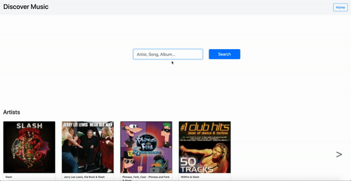

# Discover Music

A music search application where a user can search any album, artist, track. This application uses Apple iTunes API in order to fetch data.

### Features

* The user can search of any item like album, artist, track on the home page.
* Once an item is searched artists and albums related to the search will be displayed on the Home page.
* User can see 5 most recently searched items under Recent Searches section of the Home page.
* After the search user can select an artist and app redirects to artist page.
* On artist page a user can see artist name, thumbnail and albums of the artist.
* On Selection of album from Artist Page or Home Page Albums section. The app will redirect to album page.
* On Albums page user can see artist name, thumbnail and all the tracks in the album.
* On selection of the artist thumbnail on album page, the app will redirect to the artist's page.
* The tracks are displayed in the albums page and user can select the track to listen to it. Duration and price are also mentioned against the track.
* The user can mark any Artist, album and track as favourite and all of them will be displayed in the favourite section of the home page.
* Last searched results will always be displayed on the home page.
* If anything is not found like album or artist the app will redirect to page-not-found page.
* Please find an assignment document in the root of the app to know more about the requirements, features and design.
* State management implemented for Search Results, artists and albums.
* Updated unit tests with state management implementation.
* Caching HTTP Requests
* Page not found if any artist/album is not returned by api.

### Technology

* This project was generated with [Angular CLI](https://github.com/angular/angular-cli) version 9.1.0.
* Implemented State Management using [NgRx](https://ngrx.io/docs) version 9.1.2.

### Local Setup

* Requirements: [node.js](https://nodejs.org/en/) and [Angular CLI](https://github.com/angular/angular-cli) installed.
* Install [Redux DevTools](https://chrome.google.com/webstore/detail/redux-devtools/lmhkpmbekcpmknklioeibfkpmmfibljd?hl=en) chrome extension. To check changes in State.
* Run `cd discover-music` will go into the project folder structure.
* Run `npm install` will install all the packages required for the application.
* Run `ng serve` for the development server to run locally.
* Navigate to `http://localhost:4200/`. The app will automatically load.
* **Unit Tests & Code Coverage:** Run `ng test --code-coverage` to execute the unit tests and view code coverage.

### Deployment Strategy

The application will containerize and the image will be deployed to a node on cloud. In this process we will use Docker and Jenkins. Login to Jenkins and trigger build for deployment.

##### Below are Deployment Instructions:
* The Jenkins pipeline will first execute the unit tests and check the code coverage. The pipeline would continue to the next step if the coverage rules are passed.
* Docker is used in order to create images of the application.
* A docker file is created where we get the base images of `node:alpine`, `nginx:alpine`, steps to create image will be given.
* The Jenkins pipeline will execute the `docker file` and create images.
* Below are overview of creating docker image steps:
    1. Get `node:alpine` base image.
    2. `npm install` and `npm build` the application (dist folder will be created).
    3. Get `nginx:alpine` base image.
    4. Over write the nginx `default.conf` with custom default configs (HTTP Security headers, etc..).
    5. `copy` the dist files from the app's dist folder to default public nginx folder.
* Using above steps image is created successfully.
* The image will be added to the image repository.
* The Jenkins pipeline will take the image and deploy to the environment.
* If there is any issue in production we can always fallback to previous image.

